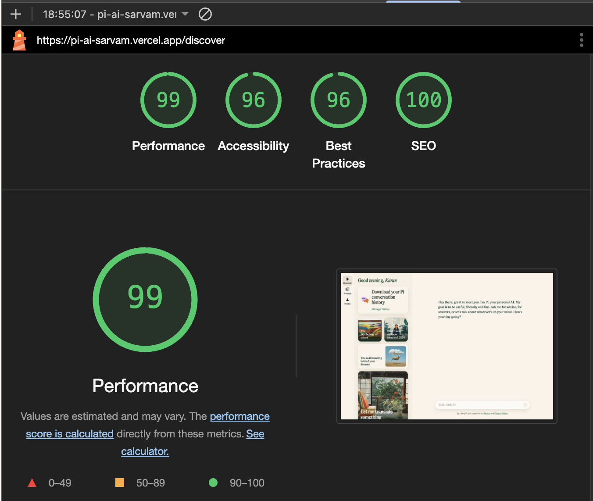
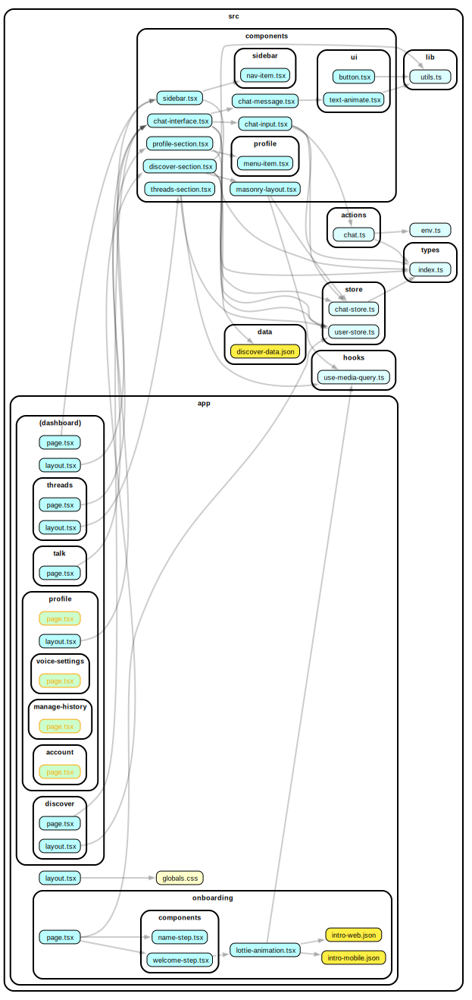

# PI AI

A modern AI assistant built with Next.js 15, featuring real-time chat capabilities and an intuitive user interface.

Built by [Prabakaran A S](https://karanweb.dev)

**Live Demo**: [https://pi-ai-sarvam.vercel.app](https://pi-ai-sarvam.vercel.app)

Try the intuitive [onboarding flow](https://pi-ai-sarvam.vercel.app/onboarding) to get started!

## Performance



## Tech Stack

- **Framework**: [Next.js 15](https://nextjs.org) with App Router
- **Styling**: [Tailwind CSS](https://tailwindcss.com)
- **State Management**: [Zustand](https://github.com/pmndrs/zustand)
- **UI Components**: [Shadcn UI](https://ui.shadcn.com)

## Project Structure



## Getting Started

1. Clone the repository:
```bash
git clone <repository-url>
cd pi-ai
```

2. Install dependencies:
```bash
pnpm install
```

3. Start the development server:
```bash
pnpm dev
```

Open [http://localhost:3000](http://localhost:3000) to view the application.

## Development

- `src/app/*` - App router pages and layouts
- `src/components/*` - UI components
- `src/store/*` - Global state management
- `src/actions/*` - Server actions

## Deployment

This project is deployed on [Vercel](https://vercel.com).
